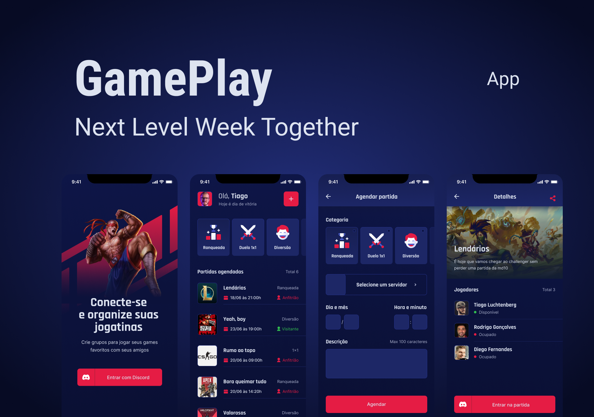

 
Gameplay
</h1>

It is an application that is responsible for recording your games with discord

  

[//]: # "Add your gifs/images here:"

   

## Features

[//]: # "Add the features of your project here:"

This app features all the latest tools and practices in mobile development!

- ⚛️ **React Native** — A lib that provides a way to create native apps for Android and iOS
- 🧾 **AsyncStorage** - A database

## Getting started

**Getting started with the mobile app**

1. Move yourself to the mobile folder: `cd gameplay`
2. Run `yarn install` to install dependencies
3. Run `expo start` to start mobile application

## License

This project is licensed under the MIT License - see the [LICENSE](https://opensource.org/licenses/MIT) page for details.
